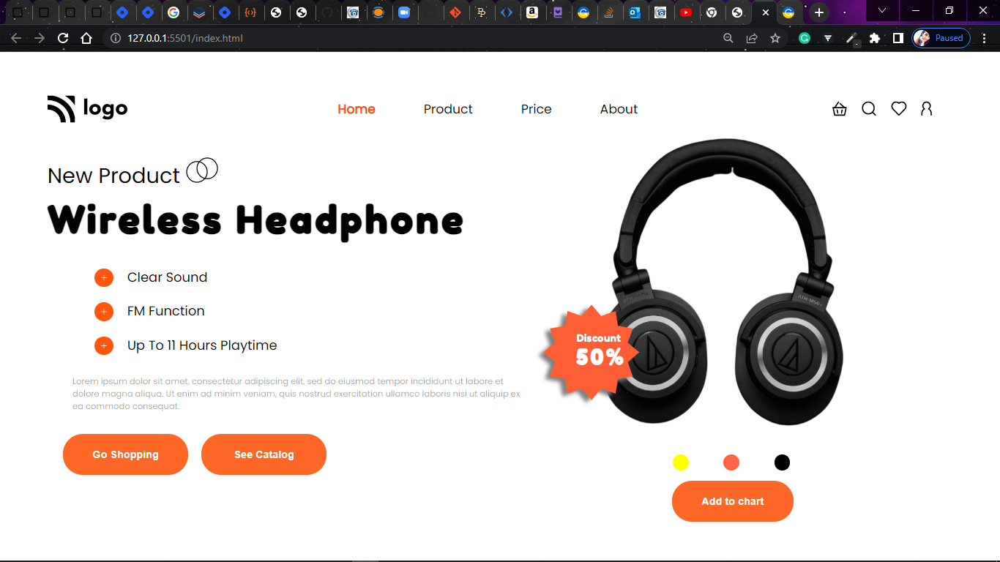

# Project-07/15 
It is a static home page made using **HTML & CSS**.

#### From this project, I've learned:-

1. About css translate property.
2. About drop shadow property.
2. Practiced more on absolute and relative css positions.

> ### The Screenshot of the site is attached here:-

Time taken: 

> ### Link to the project: [Product home page](https://aim-product-home-page.netlify.app/)